# Lab 2: Create AI Agents in Azure AI Foundry Agent Service UI

In this Lab, you’ll learn how to create and experiment with AI Agents in Azure AI Foundry Agent Service UI. You will:
- Create a single agent that can answer questions using both Bing Search and internal documents (PDF, CSV)
- Add and configure knowledge sources, including Bing Search and file-based data
- Use the code interpreter tool for data analysis and visualization
- Interact with your agent to troubleshoot, analyze, and visualize data
- Explore multi-agent setups by connecting specialized agents (e.g., HR assistant)
- Practice prompt engineering and data troubleshooting to ensure accurate results

By the end, you’ll understand how to build, configure, and test agents that combine real-time search, internal knowledge, and code-based analysis in Azure AI Foundry.

## Part 1: Create a single AI Agent

### Step 1: Create a Grounding with Bing Search service in the Azure Portal
1. This has already been completed during our setup in Lab 1!

### Step 2: Create an AI Agent and give it tools
1. **Navigate to your Azure AI Foundry project: https://ai.azure.com/**. You should see a view like below. Make sure you are working inside of your project:

    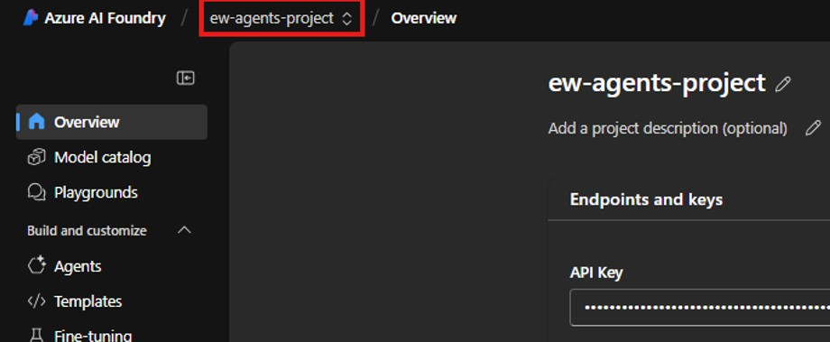

2. On the left pane, go to **'agents'** and **create a new agent**

3. Once in your agent, click on **'go to playground'. Ask it a few questions**: 

        'what can you do?'
        'what is the weather'
        'what time is it?'

    Note that it cannot return a response...we need to give it the tools to be able to answer real-time questions like these.

4. **Add in Grounding with Bing Search as a knowledge source**

    
    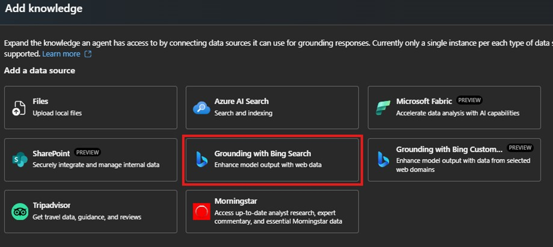
    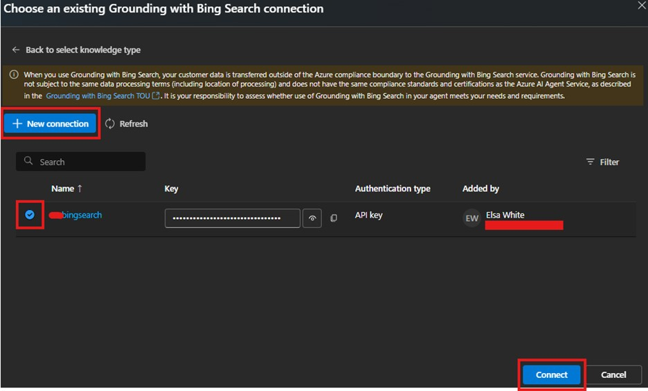

5. After you've added Bing Search, **try entering the above questions again**. It should be able to answer them now.

6. Once you are done experimenting with Bing, **remove Bing Search as a knowledge source**. The below sections of the labs do not require it and will use grounding documents instead.

    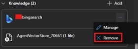

7. Next we will **add a local file as an additional knowledge source**. For the Knowledge Source, click Files, and then Select Local Files to add and upload the Internal Policy Document for Contoso Tech Support Agents.pdf (saved in the 'data-lab2' folder)

    💡What’s happening here?
    - When you upload data for file search in Azure AI Agent Service, a vector store is created to manage and search the uploaded files. This process involves several steps to ensure the data is properly indexed and searchable.
    - First, the uploaded files are automatically parsed and chunked into smaller segments. Each chunk is then embedded, meaning it is converted into a vector representation that captures the semantic meaning of the content. These vectors are stored in a vector database, which supports both keyword and semantic search capabilities.
    - Once the vector store is created, it can be attached to both agents and threads, allowing for seamless integration and efficient file management across different AI applications

    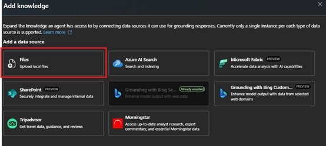
    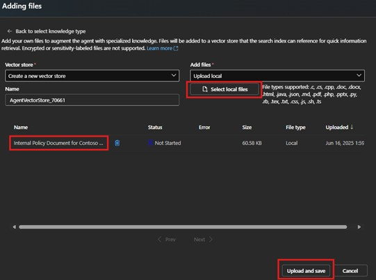

8. Still in the playground view, **add the following description to the instructions for the agent** (in the Instructions placeholder on the right side of the screen):

```python
You are a helpful assistant for the company Contoso Tech. You can search files and answer questions based on the file content. You can utilize file search grounded on internal data to efficiently search through proprietary documents and provide accurate answers based on the content. This feature allows you to manage and index uploaded files for efficient keyword and semantic search, enhancing your ability to assist users with their queries.

You have access to a code interpreter tool that allows you to analyze data, create visualizations, and perform calculations. Be thorough and precise in your answers. For CSV and structured data, provide meaningful insights and summaries when appropriate.

Use the code interpreter when:
1. Analyzing numerical data or statistics in CSV or JSON files
2. Creating visualizations of data when it would help explain your answer
3. Performing calculations or transformations on data
4. Extracting specific information from complex structured data

When using the code interpreter, follow these guidelines:
- Write clear, concise code with comments explaining your approach
- Use pandas for data analysis, matplotlib/seaborn for visualizations
- Use descriptive variable names and follow best practices
- Show intermediate steps for complex analyses
- Interpret results for the user in plain language after showing code output

When creating visualizations:
- Use clear titles, axis labels, and legends
- Choose appropriate chart types for the data
- Use matplotlib or seaborn for creating visualizations
```

9. Now, we will **add in a code interpreter action**

    The code interpreter tool enables agents to write and run Python code in a sandboxed environment. This feature is useful for tasks like generating graphs, performing calculations, and analyzing datasets. Agents can iteratively modify and rerun code until execution succeeds. 

    For the Actions, select Code Interpreter. Then select upload files and upload the Contoso_Tech_Product_Data.csv from the 'data-lab2' folder to the Code Interpreter tool

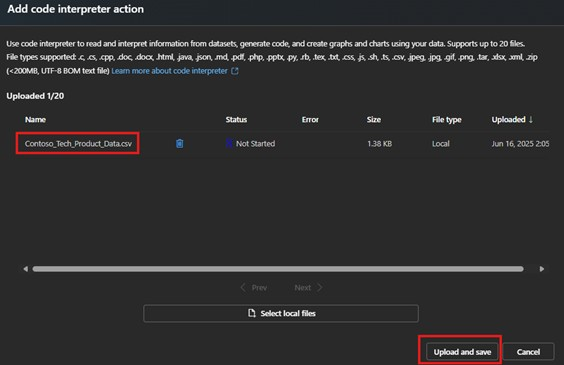

For context on the two files we have just uploaded:
- The pdf file is an Internal Policy Document for Contoso Tech Support Agents, which outlines the policies and procedures that support agents must follow when assisting customers. It covers key guidelines for handling returns, processing warranty claims, shipping options, order tracking, privacy policy, and customer support procedures.
- The csv file provided contains sales data for various products sold by Contoso Tech. Each product is listed with its name, category, price, units sold, and the quarter in which the sales occurred. This data provides insights into the sales performance of different products over specific quarters.

### Step 3: Chat with our new AI Agent

1. **Chat with your agent**. Now you're free to ask your agent questions based on the data provided, here are some sample questions to try out and see how the agent responds. We can also ask for analysis based on the data provided.

Questions for the policy document:

        'What are the key guidelines for handling returns at Contoso Tech?'
        'Which items are non-refundable according to Contoso Tech's policy?'
        'What are the contact details for Contoso Tech's support team?'


Questions for the products data:

        'Create a bar chart highlighting the top 5 products with the highest units sold'

 💡The CSV is semi-colon delimited, which the agent does not expect. Fix this issue by simply chatting with your agent!

 💡Once your agent fixes your CSV, inspect the bar chart that it created. Is it correct? If not, open the CSV to understand what is happening. Continue chatting with the agent until you get the right graph. This underscores the importance of knowing your data and applying good prompt engineering techniques!

Expected chart from 1st attempt (this is not the answer we are looking for!):


Corrected chart (after chatting with the agent to correct the results):

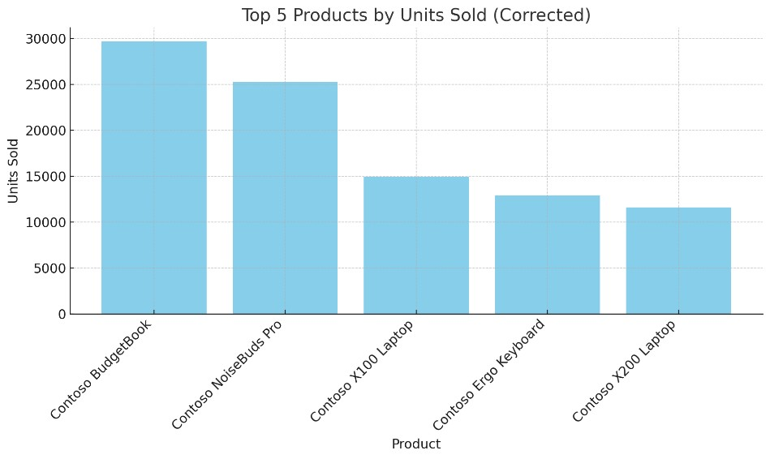

Now, ask your agent to generate a pie chart:

        'Generate a pie chart showing the units sold for each product category. Include the number of units per category as well as percentages.'

Expected pie chart result:

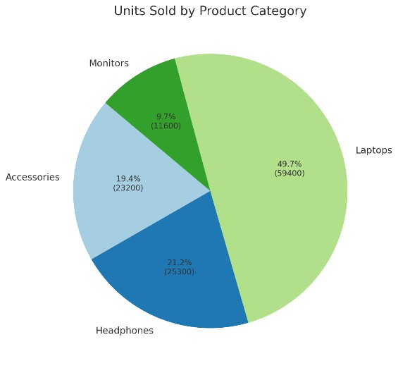

**Part 1 recap**: In this section we explored the Azure AI Agent Service UI, focusing on creating agents and adding tools like file search for searching through proprietary data and the code interpreter for data analysis. These features enable efficient data management, automated workflows, and insightful visualizations. The agent service playground provides a robust environment for experimenting with these tools and enhancing your projects. In the following section we explore how to get started with connected agents.

## Part 2: Create a multi-agent setup with connected agents 

### Step 1: **Create a new agent**. Name it something like ‘Contoso Tech HR Assistant'. NOTE: if you are working in a project with other users, be sure to give it a unique name (e.g, add your initials to the end)

1. **Add the following knowledge documents (found in 'data-lab2' folder) to this new agent**: 
- code_of_conduct
- performance_review_process
- hr_policy holiday_and_vacation_policy
- remote_work_policy

2. **Give the agent an appropriate system prompt (ie 'instructions')**. The system prompt should guide the agent to behave as a helpful and knowledgeable HR assistant. You can use the example below, or create your own.

```txt
You are a helpful and knowledgeable HR assistant for Constoso Tech. You provide accurate, clear, and friendly answers to employees' questions about HR policies, benefits, leave, workplace conduct, and other internal procedures.
 
You have access to internal HR documents and resources. Always prioritize information from these internal sources when answering questions. If a question cannot be answered from internal documents, you may use external tools like Bing Search to provide general guidance, but clearly indicate when the information is not from internal policy.
 
Be concise and professional. Use plain language and avoid jargon. If a question is outside your scope (e.g., legal or payroll-specific), recommend contacting the appropriate department.
 
When answering:
 
- Summarize relevant policy content clearly.
- Provide links or document references when possible.
- If multiple interpretations exist, explain the options neutrally.
- Maintain confidentiality and neutrality at all times.
```

### Step 2: Add your new HR assistant as a connected agent

1. Scroll down to the Connected agents section of your **main agent's** setup panel and select Add +

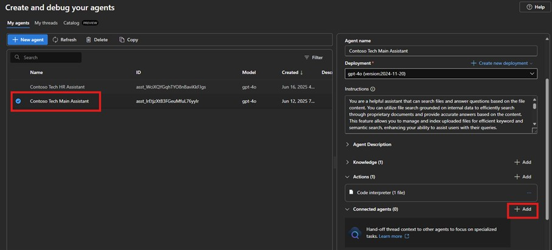

2. In the dialog that appears, we will choose an agent for the main agent to delegate tasks to, and specify the following:

- Select your new HR agent from the dropdown. This is our connected agent that your main agent will delegate tasks to.
- Enter a unique name for the connected agent (letters and underscores only). This name is used for API-level function calling. Keep it descriptive and machine-readable to maximize recall accuracy (for example: answer_hr_questions).
- Add the below description, which specifies when and why the connected agent should be invoked. This helps guide the main agent’s decision-making on when to hand off tasks to connected agents during runtime.

```txt
Activate this agent when the user asks questions related to HR topics such as benefits, leave policies, workplace conduct, onboarding, or internal HR procedures. Route queries to this agent if keywords like “vacation,” “PTO,” “insurance,” “HR policy,” or “employee handbook” are detected.
```

- Select Add. NOTE: if we needed to add any other specialized agents, we would simply repeat the above steps.

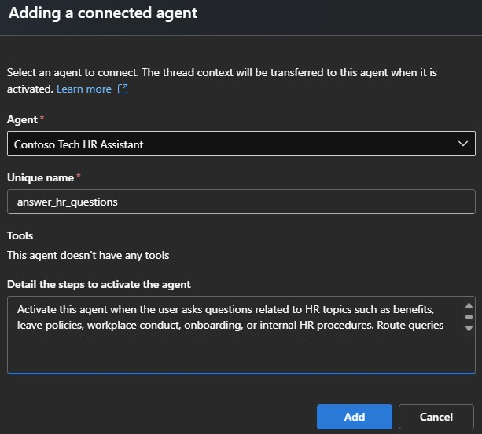

3. Once the connected agent appears in the setup panel of your main agent, scroll up and select 'Try in Playground'.

4. Use test prompts in the Agent Playground to validate that the main agent correctly routes tasks to the connected agents when applicable.

Try a couple of the below prompts, or try  your own:

```txt
What's Contoso Tech's vacation policy?
What’s the remote work policy?
How many sick days do I get at Contoso Tech?
```

The main agent should delegate this request to the connected HR agent based on the routing description you defined previously. To confirm this, you will see in your main agent chat the connected agent being called, like this:


## Cleanup

You can delete your agents manually. If you are working inside a project with other users, be sure to not accidentally delete other's agents.