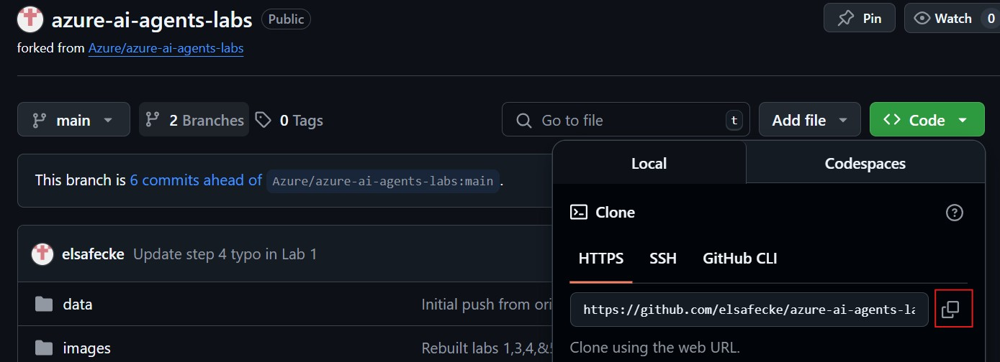

# Hands-On Labs for AI Agents Using Azure AI Agent Service SDK

This repository provides a series of hands-on labs for building and orchestrating AI Agents using the Azure AI Agent Service SDK. You will learn to set up your Azure environment, deploy models, create and connect agents, and build advanced multi-agent systems.

## Prerequisites
- Azure subscription
- Azure AI Foundry resource with an AI Project (set up in Lab 1)
- For Labs 1, and 3-5:
-   Option #1: to run the labs locally, you will need:
      1. Visual Studio Code (or your preferred IDE) installed
      2. Python 3.10 or higher installed
      3. Azure CLI
-   Option #2: to run the labs in a cloud environment, you can use Github Codespaces. This only requires a Github account. Note: your organization may have certain security policies in place that prevent running Labs in the cloud. In that case, please proceed with option #1

## How to Get Started

If you are running the labs locally...

1. Clone the repo by copying the URL 

   

2. Open VS Code. On the main page, select 'Clone git repository' and paste the URL you just copied into the top window. It will ask you where you want to save the folder, that is up to you.

   

If you are running the labs in Github Codespaces...

1. Select Codespaces and create a new workspace. That's it!

   

## Labs Overview

- **Lab 1: Environment Setup and Testing**  
  Set up your Azure AI Foundry project, deploy LLM and embedding models, connect from VS Code, and verify your environment with a test chat completion.

- **Lab 2: Create an AI Agent in Azure AI Foundry UI**  
  Use the low-code UI to build an AI agent that extracts answers from Excel files and retrieves real-time information from Bing Search.

- **Lab 3: Build a Simple AI Agent**  
  Develop a Python-based AI agent in Azure that generates a bar chart comparing health insurance plan costs.

- **Lab 4: Build a Retrieval Augmented Generation (RAG) Agent**  
  Create an AI agent that performs RAG on health plan documents using Azure AI Search as a vector database for embeddings.

- **Lab 5: Develop a Multi-Agent System**  
  Build a system of four collaborating agents: a Search Agent (queries Azure AI Search), a Report Agent (generates detailed reports), a Validation Agent (checks report requirements), and an Orchestrator Agent (manages agent interactions).

Each lab is designed to be practical and builds on the previous, giving you hands-on experience with Azure AI services, agent orchestration, and real-world AI solutions.
